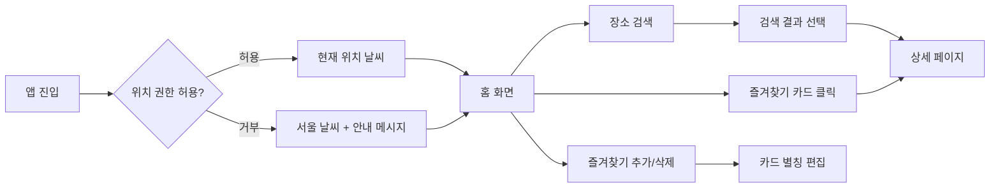
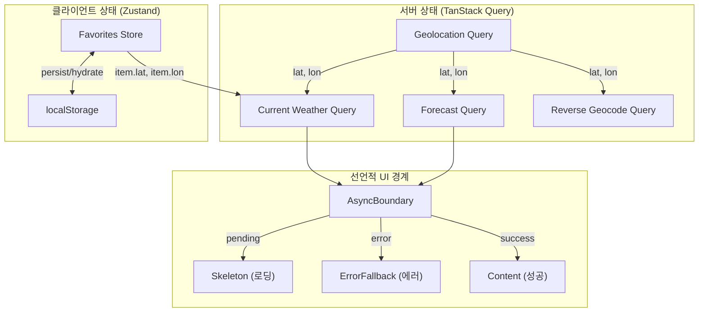

# 날씨 앱

OpenWeatherMap API를 활용한 날씨 정보 조회 앱입니다. 현재 위치 기반 날씨, 행정구역 검색, 즐겨찾기 관리 기능을 제공합니다.

## 프로젝트 실행 방법

### 사전 요구사항

- Node.js 20 이상
- [OpenWeatherMap API Key](https://openweathermap.org/api)

### 설치 및 실행

```bash
git clone https://github.com/<username>/real-teeth.git
cd real-teeth
npm install
```

루트 디렉토리에 `.env` 파일을 생성합니다.

```
VITE_OPENWEATHER_API_KEY=<발급받은_API_KEY>
```

```bash
npm run dev
```

### 빌드

```bash
npm run build
npm run preview
```

## 사용한 기술 스택

| 구분 | 기술 | 선택 이유 |
|---|---|---|
| Framework | React 19, TypeScript | 함수형 컴포넌트 + 타입 안전성 |
| Build | Vite 7 | 빠른 HMR, ESM 네이티브 |
| Styling | Tailwind CSS 4 | 유틸리티 기반, CSS-in-JS 없이 반응형 구현 |
| Server State | TanStack Query 5 | 서버 상태 SoT, Suspense 연동 |
| Client State | Zustand 5 | 즐겨찾기 영속화, 최소 보일러플레이트 |
| Routing | React Router 7 | SPA 라우팅, errorElement 지원 |
| Validation | Zod 4 | 환경 변수/localStorage 런타임 검증 |
| Animation | Motion (Framer Motion) | 선언적 애니메이션, reducedMotion 지원 |

## 설계

### 유저 플로우



### 상태 흐름



### 비동기 경계 구조

각 섹션이 독립적인 `AsyncBoundary`를 가지므로, 한 섹션이 실패하거나 로딩 중이어도 나머지는 정상 동작합니다.

```
App (QueryErrorResetBoundary + ErrorBoundary)
└── HomePage
    ├── AsyncBoundary → WeatherContent        ← AppErrorFallback (페이지 레벨)
    │   ├── AsyncBoundary → CurrentWeather    ← SectionErrorFallback ("현재 날씨를 불러올 수 없습니다")
    │   └── AsyncBoundary → HourlyForecast   ← SectionErrorFallback ("시간별 예보를 불러올 수 없습니다")
    └── FavoritesSection
        └── AsyncBoundary → FavoritesGrid    ← SectionErrorFallback ("즐겨찾기를 불러올 수 없습니다")
```

### FSD 아키텍처

수직 슬라이싱 원칙에 따라, 기능 단위로 코드를 구성합니다.

```
src/
├── app/            # 앱 초기화, 프로바이더, 라우터
├── pages/          # 라우트별 페이지 컴포넌트
│   ├── home/
│   └── detail/
├── widgets/        # 독립적인 UI 블록
│   └── weather-detail/
├── features/       # 사용자 상호작용 단위
│   ├── search-location/
│   └── manage-favorites/
├── entities/       # 비즈니스 도메인 모델
│   ├── weather/
│   ├── location/
│   └── favorite/
└── shared/         # 공유 유틸, UI, API, 설정
    ├── api/
    ├── config/
    ├── lib/
    └── ui/
```

- **단방향 의존성**: `shared` → `entities` → `features` → `widgets` → `pages` → `app` 순서로만 import합니다.
- **Public API**: 각 슬라이스는 `index.ts`를 통해 외부에 노출할 것만 export합니다.

## 구현한 기능

### 1. 현재 위치 기반 날씨 조회

- Geolocation API로 사용자 위치를 감지하여 현재 날씨를 표시합니다.
- 위치 권한이 거부되면 서울(fallback) 날씨를 표시하고 안내 메시지를 노출합니다.
- 현재 기온, 최저/최고 기온, 바람, 습도, 구름 정보를 제공합니다.

### 2. 시간별 예보

- 3시간 간격의 시간별 예보를 8개 슬롯으로 표시합니다.
- 현재 시간에 가장 가까운 슬롯을 하이라이트합니다.

### 3. 장소 검색

- 제공된 `korea_districts.json` 데이터를 활용하여 시/군/구/동 단위로 검색할 수 있습니다.
- 검색어 입력 시 매칭되는 장소 리스트를 표시하고, 선택하면 해당 장소의 상세 페이지로 이동합니다.
- 키보드 네비게이션(위/아래 화살표, Enter, Escape)을 지원합니다.
- 해당 장소의 날씨 정보가 없는 경우 "해당 장소의 정보가 제공되지 않습니다." 메시지를 표시합니다.

### 4. 즐겨찾기

- 검색한 장소를 즐겨찾기에 추가/삭제(토글)할 수 있습니다.
- 최대 6개까지 추가 가능하며, 카드 UI 형태로 표시됩니다.
- 즐겨찾기 장소의 별칭을 인라인 편집으로 수정할 수 있습니다.
- 카드에 현재 날씨, 최저/최고 기온을 표시하고, 클릭하면 상세 페이지로 이동합니다.
- `localStorage`에 영속화하여 새로고침 후에도 유지됩니다.

### 5. 반응형 디자인

- 모바일(~768px)과 데스크탑 뷰에 맞춘 반응형 레이아웃입니다.
- 즐겨찾기 그리드는 모바일 2열, 데스크탑 3열로 구성됩니다.

## 기술적 의사결정 및 이유

### TanStack Query를 서버 상태의 단일 진실 공급원(SoT)으로 활용

서버에서 받아오는 날씨 데이터를 별도의 클라이언트 상태로 복제하지 않고, TanStack Query의 캐시를 SoT로 사용합니다.

- `useSuspenseQuery`로 데이터 로딩/에러/성공 상태를 컴포넌트 외부(`AsyncBoundary`)에서 선언적으로 처리합니다.
- `staleTime`과 `gcTime`을 설정하여 불필요한 API 호출을 방지합니다.
- `QueryErrorResetBoundary`와 `ErrorBoundary`를 연동하여, "다시 시도" 시 쿼리 캐시의 에러 상태까지 초기화한 뒤 refetch합니다.
- 클라이언트 전용 상태(즐겨찾기)는 Zustand로 분리하여, 서버 상태와 클라이언트 상태의 관심사를 명확히 구분합니다.

### Suspense + ErrorBoundary 선언적 비동기 처리

`AsyncBoundary`를 만들어 `Suspense`와 `ErrorBoundary`를 조합하고, 각 섹션마다 독립적인 비동기 경계를 설정합니다.

- 각 섹션(현재 날씨, 시간별 예보, 즐겨찾기)이 독립적으로 로딩/에러 상태를 가집니다. 한 섹션이 실패해도 나머지는 정상 표시됩니다(Partial Degradation).
- 에러 fallback을 앱 레벨(`AppErrorFallback`)과 섹션 레벨(`SectionErrorFallback`)로 계층화하여, 에러의 심각도에 따라 다른 UI를 보여줍니다.

| 계층 | 컴포넌트 | 역할 |
|---|---|---|
| 앱 레벨 | `AppErrorFallback` | 404, 429, 예상치 못한 에러 — 전체 페이지 대체 |
| 라우트 레벨 | `RouteErrorFallback` | React Router의 `errorElement`로 라우트 에러 처리 |
| 섹션 레벨 | `SectionErrorFallback` | 개별 섹션 에러 — 나머지 UI 유지, 해당 섹션만 에러 + 재시도 |

### Semantic HTML

- `<main>`, `<section>`, `<h1>`~`<h2>` 등의 시맨틱 태그로 페이지 구조를 표현합니다.
- `aria-label`로 각 섹션의 역할을 명시합니다.
- 인터랙티브 요소는 `<button>`, `<a>`, `<input>` 등 네이티브 요소를 사용합니다.

### 매직 넘버 제거

의미 없는 숫자를 상수로 추출하여 의도를 명확히 합니다.

- `MAX_FAVORITES = 6`, `COORD_THRESHOLD = 0.001`, `HOURLY_DISPLAY_COUNT = 8`
- `MAX_NICKNAME_LENGTH = 20`, `FALLBACK_COORDS` (서울 좌표)
- `staleTime`, `gcTime` 등 캐시 설정값도 named constant로 관리

## 요구조건 외 추가한 UX 요소

| 요소 | 설명 |
|---|---|
| 스켈레톤 UI | 섹션별 스켈레톤으로 레이아웃 시프트 없이 로딩 상태를 표시 |
| Partial Degradation | 한 섹션이 실패해도 나머지 섹션은 정상 렌더링 |
| 검색 키보드 네비게이션 | 위/아래 화살표, Enter, Escape로 검색 결과 탐색 |
| 검색 영역 외 클릭 닫기 | `useClickOutside` 훅으로 결과 패널 자동 닫기 |
| Glassmorphism 디자인 | `glass`, `glass-accent` 유틸리티 클래스로 통일된 시각 스타일 |
| 진입 애니메이션 | stagger 기반 fade-in-up 애니메이션으로 콘텐츠 전환 |
| reducedMotion 지원 | `MotionConfig reducedMotion="user"`로 접근성 대응 |
| 환경 변수 런타임 검증 | Zod 스키마로 `.env` 누락 시 앱 시작 단계에서 즉시 실패 |
| localStorage 데이터 검증 | Zustand persist의 `merge`에서 Zod로 검증하여 손상된 데이터 복구 |

## 어려웠던 문제와 해결

### 1. Geolocation API를 TanStack Query에 통합

**문제**: 브라우저 Geolocation API는 콜백 기반이고, 권한 거부 시 에러를 던집니다. 이를 `useSuspenseQuery`의 Promise 기반 모델과 어떻게 통합할지 고민이 있었습니다.

**해결**: Geolocation API를 Promise로 감싼 `queryFn`을 만들고, 권한 거부 시 에러를 던지는 대신 fallback 좌표(서울)를 반환하도록 설계했습니다. `source: 'browser' | 'fallback'` 필드를 추가하여 UI에서 fallback 여부를 판단할 수 있게 했습니다. 이를 통해 권한 거부가 "에러"가 아닌 "정상적인 대체 경로"로 처리되어 에러 바운더리가 불필요하게 트리거되지 않습니다.

### 2. 좌표 기반 즐겨찾기 중복 방지

**문제**: 같은 장소를 두 번 추가하는 것을 방지해야 하는데, 부동소수점 좌표는 정확한 일치(`===`)로 비교할 수 없습니다.

**해결**: `COORD_THRESHOLD = 0.001`(약 111m)을 기준으로 두 좌표의 차이가 이 임계값 이내이면 같은 장소로 판단합니다. 이 상수를 named constant로 추출하여 의도를 명확히 했습니다.

### 3. localStorage 데이터 무결성

**문제**: Zustand의 `persist` 미들웨어로 즐겨찾기를 `localStorage`에 저장하는데, 사용자가 직접 수정하거나 스키마가 변경되면 앱이 깨질 수 있습니다.

**해결**: `persist`의 `merge` 옵션에서 Zod 스키마로 `localStorage`에서 불러온 데이터를 검증합니다. 검증 실패 시 기본 상태(`{ favorites: [] }`)로 복구하여, 손상된 데이터가 앱을 깨뜨리지 않도록 합니다.
